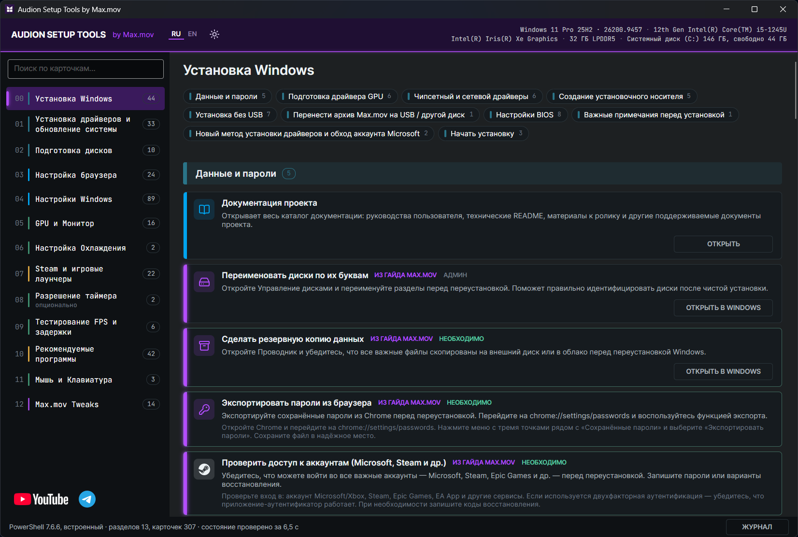

# Audion Setup Tools by Max.mov

<!-- audion:release -->

  
  
  
  

**Version 2.3.2** · 2026-09-28 · 88.2 MB

- [Direct download](https://dl.audion.dev/setup-tools/2.3.2/Audion_Setup_Tools_v2.3.2.zip) — unmetered, no rate limits
- [Project page](https://audion.dev/downloads/setup-tools) — every version and how to install
- [GitHub release](https://github.com/Tensionix/setup-tools/releases/tag/v2.3.2)

`SHA-256: 9c69a3f82351ea2e5ef4cd5822aaab853b9763f7fc2e5705b80158c7345a55a4`

---

An **Audion** tool, published by [Tensionix](https://github.com/Tensionix).
<!-- /audion:release -->

[English README](Docs/README_EN.md) · [User Guide](Docs/USER_GUIDE_EN.md) | [Русский README](Docs/README_RU.md) · [Руководство](Docs/USER_GUIDE_RU.md)

**Contents**

- [Why It Exists](#why-it-exists)
- [The Central Decision](#the-central-decision)
- [Starting](#starting)
- [What The Window Does](#what-the-window-does)
- [Section Map](#section-map)
  - [00 · Windows Installation](#00--windows-installation)
  - [01 · Driver Installation](#01--driver-installation)
  - [02 · System Update](#02--system-update)
  - [03 · Disk Preparation](#03--disk-preparation)
  - [04 · Browser Setup](#04--browser-setup)
  - [05 · Windows Settings](#05--windows-settings)
  - [06 · GPU & Monitor Settings](#06--gpu--monitor-settings)
  - [07 · Cooling Setup](#07--cooling-setup)
  - [08 · Steam & Game Launchers](#08--steam--game-launchers)
  - [09 · Global Timer Resolution (Optional)](#09--global-timer-resolution-optional)
  - [10 · FPS & Latency Testing](#10--fps--latency-testing)
  - [11 · Recommended Programs](#11--recommended-programs)
  - [12 · Mouse & Keyboard Settings](#12--mouse--keyboard-settings)
  - [13 · Max.mov Tweaks](#13--maxmov-tweaks)
- [Next](#next)

An interactive companion to a large Windows configuration guide — and a
standalone assistant for preparing a workstation.

## Why It Exists

There is a detailed Windows configuration guide running to seven hours of video.
Going through it takes a weekend, and half the steps are forgotten halfway: where
that settings page was, what exactly to change there, how to put it back.

This program does not retell the guide line by line. It takes the familiar
sequence and adds what video cannot: **states, rollback, automation**, and
practical scenarios of its own.

## The Central Decision

**The program does not apply tweaks automatically.**

It organises verified actions, opens the relevant Windows sections and external
utilities, performs what it can perform, and shows what the operator must check
personally.

A non-specialist can follow the route through the cards without hunting for each
system page by hand. But **reading the description before pressing is required of
everyone**.

## Starting

Double-click `Start.exe` and allow the administrator prompt: the program changes
system settings. It needs 64-bit Windows 10 or 11 and nothing else: PowerShell 7
and .NET are inside the program.

## What The Window Does

* **A card** shows where the step comes from (a coloured bar: Max.mov's guide,
  NVIDIA, AMD, Intel, the official route, a side road), a brand or meaning icon,
  and its state: applied, not applied, not for this machine.
* **Buttons by function:** apply or install, open in Windows, open the site,
  revert or remove, and **Windows default** - the value Windows has out of the
  box, even for settings changed long before this program.
* **Search** over all cards, subsection chips, APPLY ALL and REVERT ALL for the
  switches of a subsection.
* **A journal** of the running step with cancel and copy; Russian and English;
  dark and light themes.
* The program runs as administrator, but pages and sites open as you - in your
  browser, with your extensions and accounts.

Formerly Audion Windows Tools by Max.mov (1.x).

<!-- section-map -->
## Section Map

14 sections, 71 subsections, 333 cards - in the order the program shows them. Every card in detail is in the [User Guide](Docs/USER_GUIDE_EN.md).

### 00 · Windows Installation

- **Data & Passwords** — Project documentation · Rename disks to their drive letters · Back up your data · Export browser passwords · Verify account access (Microsoft, Steam, etc.)
- **GPU Driver Preparation** — Laptop note: download drivers for BOTH GPU and iGPU · Find your GPU model · Download Nvidia GPU driver · Download AMD GPU driver · Download Intel GPU / Arc driver (site availability varies by region) · Move driver installers to a USB drive or separate partition
- **Chipset & Network Drivers** — Intel VMD / RST note: disks may not appear during install · Download AMD chipset driver · Download Intel chipset INF driver (older chipsets only, site availability varies by region) · Download Intel RST driver · Download drivers from motherboard manufacturer website · Broadcom / Realtek / Intel Killer network drivers (other manufacturers)
- **Create Installation Media** — Download Windows 11 Installation Media (Media Creation Tool, availability varies by region) · Download official Windows 11 ISO image (availability varies by region) · Download Windows 11 images via UUP Dump (available where Microsoft's download is not) · Download Rufus (bootable USB creator) · Create bootable USB installation drive
- **Install Without USB (Optional)** — Note: not recommended if switching from Legacy to UEFI · Open Disk Management to create the install partition · Troubleshoot: cannot shrink volume (USN journal / pagefile) · Check Event Viewer if shrink fails · No-USB install: CMD method (copy ISO files to Win11 partition) · Download EasyBCD (no-USB method 2) · No-USB install: EasyBCD method
- **Move Max.mov Archive to USB / Other Drive** — Move the Audion Setup Tools by Max.mov archive and drivers to a USB or separate drive
- **BIOS Settings** — AMD note: virtualization may be called SVM or AMD-V · Disable manufacturer preinstalled software (MSI Center, ASUS Armoury Crate, etc.) · Disable CSM Support and enable Secure Boot · Enable TPM 2.0 (Intel PTT, AMD fTPM, or physical TPM module) · Disable unused devices (audio, iGPU if not needed) — desktop only · Disable virtualization (if not needed) — disables VBS · Disable unused drives in BIOS (if supported) · Enable PWM mode for 4-pin fans
- **Important Notes Before Installation** — If PC reboots back to setup instead of OOBE — read this
- **New Driver Install Method & MS Account Bypass** — Watch video guide: new driver installation method during OOBE · Install drivers during OOBE (before internet, without MS account)
- **Start Installation** — Reboot and boot from USB installation drive · Boot into installation: no-USB CMD method (reboot into recovery mode) · Boot into installation: no-USB EasyBCD method (select NST entry on reboot)

### 01 · Driver Installation

- **Setup Notes** — v0.4 setup note — skip this section if drivers were installed during OOBE · Open Device Manager
- **NVIDIA Drivers** — Download NVIDIA Game Ready driver · Download NVIDIA Studio driver · NVIDIA App — driver updates and game optimization · NVCleanstall — minimal NVIDIA driver installer · Install NVIDIA GPU driver (clean, no bloatware) · DDU — Display Driver Uninstaller · Remove old GPU driver with DDU
- **AMD Drivers** — Download official AMD graphics driver · Download official AMD chipset driver · Install AMD graphics/chipset drivers
- **Intel Drivers** — Install Intel Driver & Support Assistant via winget · Intel Driver & Support Assistant — official page · Download Intel Arc / integrated graphics driver · Download Intel Chipset INF (Chipset Device Software) · Download Intel Management Engine driver · Download Intel RST driver
- **Qualcomm Snapdragon Drivers** — Download Qualcomm Snapdragon X graphics driver
- **Wi-Fi & Network Drivers** — Open motherboard / laptop support page · Install chipset and network drivers · Realtek Wi-Fi adapter drivers · Realtek LAN drivers (PCIe GbE / 2.5GbE) · Realtek Bluetooth drivers · Intel Wireless Wi-Fi drivers · Intel Wireless Bluetooth drivers · Intel Ethernet network drivers · MediaTek / MTK Wi-Fi driver guidance · MediaTek Wi-Fi drivers — Microsoft Update Catalog · MediaTek Bluetooth drivers · Qualcomm Wi-Fi drivers (FastConnect, Atheros, Killer) · Qualcomm Bluetooth drivers · Broadcom Wi-Fi drivers · Broadcom Bluetooth drivers · Broadcom LAN drivers (NetXtreme) · Marvell AQtion LAN drivers (Aquantia 5G / 10G) · Killer Ethernet drivers (E2xxx, E3xxx) · Killer Wi-Fi drivers · Enable Wi-Fi or connect Ethernet cable
- **Audio Drivers** — Download Realtek audio driver

### 02 · System Update

- **System, Runtime & Reboot** — Set PC name · Check for Windows Updates · Check optional driver updates · Install Visual C++ Redistributables (official) · Install / Update Visual C++ 2015-2022 Redistributables via winget · Install Visual C++ Redistributables 2005-2022 (all-in-one pack) · Visual C++ Redistributable AIO — GitHub releases (abbodi1406) · ⚠ Restart Windows now (60 second timer) · Cancel scheduled restart · Restart after all updates are installed

### 03 · Disk Preparation

- **Partition Cleanup** — Delete Windows installation files partition (no-USB method) · MiniTool Partition Wizard — advanced partition manager · Reconnect previously disconnected drives
- **Drive Letters & Explorer** — Verify all drives are visible in Explorer · Assign drive letters (if drives are missing or mixed up)
- **User Folder Relocation** — Copy User folder to a second partition or drive · Redirect user shell folders to the new location · Relocate user folders to C:\<username>\ (script)
- **Apps & Gaming Folders** — Set up Apps folder for portable applications · Set up Gaming folder for games and launchers (optional)

### 04 · Browser Setup

- **Install Browser** — Google Chrome · Brave Browser · Mozilla Firefox · Vivaldi · Opera · WebView2 Runtime (standalone — required if removing Edge) · Set default browser
- **Edge Configuration** — Configure Microsoft Edge settings · Configure sound devices & default playback · Browser setup guide (YouTube)
- **Edge — Tame It** — Disable startup boost & background running · Disable background mode when Edge is closed · Disable news feed on new tab page · Disable telemetry & diagnostic data collection · Disable Shopping Assistant (price comparison popups) · Disable Microsoft Rewards in Edge · Disable first-run experience & import prompts
- **Remove Edge (Optional)** — Read before proceeding — WebView2 dependency · Step 1 — Check if Uninstall is already available · Step 2 — Grant write access to region policy file · Step 3 — Open policy file in Notepad · Step 4 — Find the Edge entry and enable uninstall · Step 5 — Click Repair on Edge (reloads policy) · Step 6 — Uninstall Edge

### 05 · Windows Settings

- **Explorer Settings** — Remove item-selection checkboxes & clear history · Configure Explorer view options · PowerToys — keyboard shortcut remapping · Auto-size columns (CTRL + Numpad *)
- **System** — Display — resolution, scale, refresh rate · Notifications — configure & enable startup alerts · Disable automatic Storage Sense · Enable Clipboard History (Win+V) · Disable Remote Desktop (if not needed) · Multitasking — configure Snap windows · Disable Recall AI feature (24H2+) · Review optional Windows features · Turn off Smart App Control · Guide: presentation models (how a frame reaches the screen)
- **Maintenance (Optional)** — Disable automatic Windows Maintenance
- **Power Scheme (Optional)** — How to import a power scheme · Khorvie Power Scheme · KhorvieOS Power Scheme · Ultimate Performance Scheme · High Performance Scheme · AdamX Power Scheme · Xilly Power Scheme · TJxTweaks Power Scheme · Core Power Scheme · Bitsium Power Scheme
- **CTT Tweaker (Optional)** — CTT WinUtil — GitHub (source + releases) · Chris Titus Tech Win11 Tweaker · Chris Titus Tech YouTube channel
- **Devices** — Disable Bluetooth (if not needed) · Disable Enhanced Pointer Precision · Cursor color & size · Disable Sticky Keys & Filter Keys · Install color profile
- **USB Power Management** — Disable power-saving on every device that allows it
- **SoundSwitch (Optional)** — SoundSwitch — hotkey audio device switcher
- **Phone Link (Optional)** — Connect Android phone to Windows (Link to Windows) · MS Store package download (region bypass) · Phone Link — MS Store page · Cross Device Experience Host — MS Store page · Mobile devices settings
- **Disk Indexing (Optional)** — Disable Windows Search indexing service · Remove drive indexing flag (per-drive) · Configure Search index locations
- **Network & Internet** — Mark Ethernet as metered connection · Mark Wi-Fi as metered connection · Allow device downloads over metered connections · Configure network adapter properties · DNS Benchmark — find fastest DNS for your ISP · Disable Cross-Device sync (if not needed) · Network settings for advanced users (Telegram)
- **Personalization** — Wallpaper · Colors & accent · Lock screen · Start menu layout · Taskbar configuration · Disable all Device Usage suggestions
- **More Personalization** — Classic right-click context menu (Win10 style) · Remove Gallery from File Explorer navigation pane · Remove Home from File Explorer navigation pane · Hide Start menu Recommended section (24H2) · Restore Windows Photo Viewer · ViVeTool — download (GitHub releases) · Enable 25H2 feature flags (ViVeTool) · Compact (Tablet) Taskbar mode · Auto Dark/Light theme switching (PowerToys) · Everything — fast file search with own index · Everything plugin for PowerToys Run · DisplaySwitch — quick monitor mode shortcuts
- **Apps** — Disable background app activity · Disable transfer between devices & backup · Set default apps for file extensions · Disable unnecessary startup apps · Install all Microsoft Store app updates · Game Bar: keep it on a Ryzen with two CCDs · After removing Game Bar: silence its leftovers
- **Other Startup Settings (Optional)** — Open User Startup folder · Open System Startup folder · Sysinternals Autoruns — comprehensive startup manager
- **Language & Time** — Clock on taskbar — format & display · Disable unnecessary input features · Language keyboard shortcut · Open Input Language Hotkeys dialog · Switch language hotkey: Alt+Shift → Ctrl+Shift
- **Privacy** — Disable all General privacy options · Disable online speech recognition · Disable inking & typing personalization · Set diagnostics to Required only, delete data · Disable all Search permissions · Location services · Disable app diagnostic data access · Disable custom device data sharing
- **Windows Update** — Check for Windows Updates · Check optional & driver updates · Disable Delivery Optimization (P2P updates) · Disable Find My Device (if not needed)

### 06 · GPU & Monitor Settings

- **Important Notes** — v0.4 update notes — VRR and Nvidia settings
- **Monitor Setup** — Monitor setup guide — fixed refresh rate (no VRR) · Monitor setup guide — VRR (G-Sync / FreeSync)
- **Nvidia Settings** — Open Nvidia Control Panel · Configure Nvidia driver settings (3D, DLSS, display) · Download Nvidia Profile Inspector · DLSS: choose the model and preset (NVPI) · Turn off Ansel (the Nvidia App filters go too) · Show Nvidia DLSS indicator overlay · Disable Nvidia HDCP
- **Official Nvidia Recommendations** — NVIDIA App — download · Apply NVIDIA App optimal game settings · Configure NVIDIA App DLSS Overrides · Official G-SYNC / VRR and V-Sync baseline · NVIDIA Reflex and Ultra Low Latency · Max Frame Rate and Power Management · NVIDIA Image Scaling · RTX Video Super Resolution / HDR · NVIDIA performance and DLSS status overlay

### 07 · Cooling Setup

- **Cooling Setup** — Enable PWM (Smart) fan mode in BIOS · Download Fan Control

### 08 · Steam & Game Launchers

- **Game Launchers** — Download Steam · Download Epic Games Store · Download EA App · Install EA App to a custom drive · Download Blizzard Battle.net · Download Rockstar Games Launcher · Download Xbox app · Download Valorant / League of Legends · Download TcNo Account Switcher
- **Minecraft** — Minecraft launcher notes (v0.4) · Download Minecraft (Bedrock Edition — official, requires license) · Download Minecraft Preview (Bedrock early access — official, requires license) · Download Minecraft Launcher (Bedrock + Java — official, requires license) · Download Minecraft Launcher without Microsoft Store (Java Edition — official) · Download Prism Launcher (unofficial, requires license) · Download Freesm Launcher (unofficial, no license required) · Download MultiMC Launcher (outdated, unofficial, requires license) · Browse Java Edition mods on Modrinth · Browse Java Edition mods on CurseForge · Download Modrinth app (mod manager) · Download CurseForge app (mod manager) · Download Minecraft server (Java or Bedrock — official)

### 09 · Global Timer Resolution (Optional)

- **Global Timer Resolution** — Timer Resolution — important notes (v0.3) · What is Global Timer Resolution?

### 10 · FPS & Latency Testing

- **Testing Notes** — v0.4 testing notes — Intel PresentMon & PCLatency
- **Testing Tools** — Download CapFrameX · Download Intel PresentMon · Download Nvidia FrameView · Download PCLatency · Nvidia article — Understanding and measuring PC latency

### 11 · Recommended Programs

- **Community Resources** — Viewer-recommended software (Telegram chat topic)
- **Browsers** — Google Chrome · Brave Browser · Mozilla Firefox · Vivaldi · Zen Browser
- **System Utilities** — Download Microsoft PowerToys · Download Everything (fast file search) · Download ViVeTool (unlock hidden Windows features) · Microsoft PC Manager · Microsoft PC Manager — direct .msix download (if Store unavailable) · Download Ventoy (bootable USB creator) · Download PathScan (path length viewer)
- **File Management** — Download ExplorerTabUtility (improved Explorer tabs) · Download Symbolic11 (symlink manager) · Download Nilesoft Shell (custom context menu)
- **Uninstallers** — Download Bulk Crap Uninstaller (BCUninstaller) · Download Revo Uninstaller Free
- **Security & Privacy** — Download Microsoft Safety Scanner (on-demand AV scan) · Download Kaspersky Virus Removal Tool · VirusTotal — online file & URL scanner · Download KeePassXC (password manager) · Download KeePass2Android (Android companion app) · Download VeraCrypt (disk encryption)
- **Media & Communication** — Download Telegram Desktop Portable · Download OBS Studio (screen recording & streaming) · Download 3D YouTube Downloader · Download MPC-HC (media player) · Download LosslessCut (fast video trimmer) · Download DaVinci Resolve (free professional video editor) · Download Obsidian (note-taking app)
- **Overclocking & Benchmarking** — Download MSI Afterburner (GPU overclocking & monitoring) · Download Superposition Benchmark (GPU stress test) · Download TestMem5 (RAM stability tester) · Download CapFrameX (frame capture & analysis)
- **Audio** — Download SoundSwitch (hotkey audio device switcher)
- **Gaming & Account Switching** — Download TcNo Account Switcher · Download Fan Control (cooling management) · Download qBittorrent (torrent client)
- **Smartphone + PC Ecosystem** — Phone Link — Microsoft ecosystem for Android · Download KDE Connect (cross-platform phone/PC integration) · Download Plain App (self-hosted phone/PC bridge)

### 12 · Mouse & Keyboard Settings

- **Mouse Settings** — Gaming mouse myths — 8000 Hz polling, high DPI, mouse acceleration (YouTube) · Mouse settings guide — DPI, Angle Snap, Ripple Control, polling rate, etc. (Telegram)
- **Keyboard Settings** — Magnetic keyboard setup guide — Rapid Trigger, actuation point, Snap Tap, etc. (YouTube)

### 13 · Max.mov Tweaks

- **Max.mov Hub** — What belongs in Max.mov Tweaks · Open current Audion Setup Tools folder · Open local Max.mov resources
- **Profiles & Presets** — Open local personalization pack · Open local Nvidia profiles/settings · Profiles are review-first · Legacy scripts are not shipped here
- **Wallpapers, Cursors & Visuals** — Open local wallpapers/cursors · Install cursor packs manually · Apply wallpapers through Personalization
- **Gaming Pack** — Open local Gaming resources · Open local Steam/Game Launchers pack · Open local FPS/latency testing pack · Open local Timer Resolution notes

<!-- /section-map -->

## Next

* [User Guide](Docs/USER_GUIDE_EN.md) — the route by section.
* Changelog — what changed and why.
